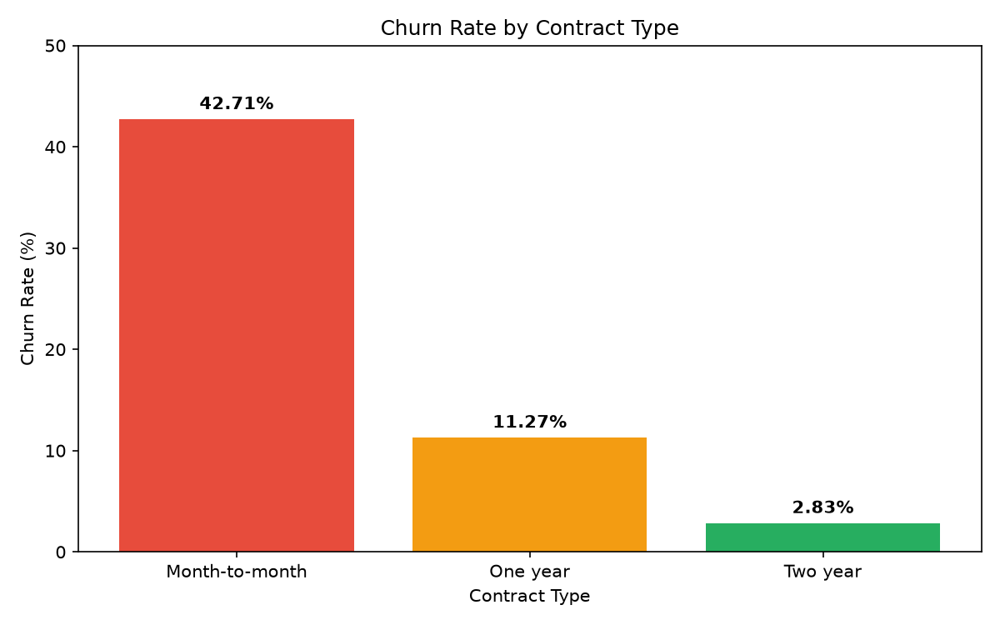
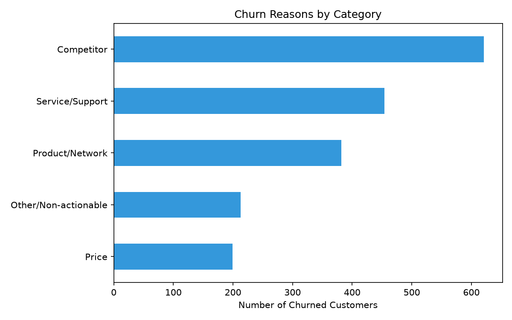
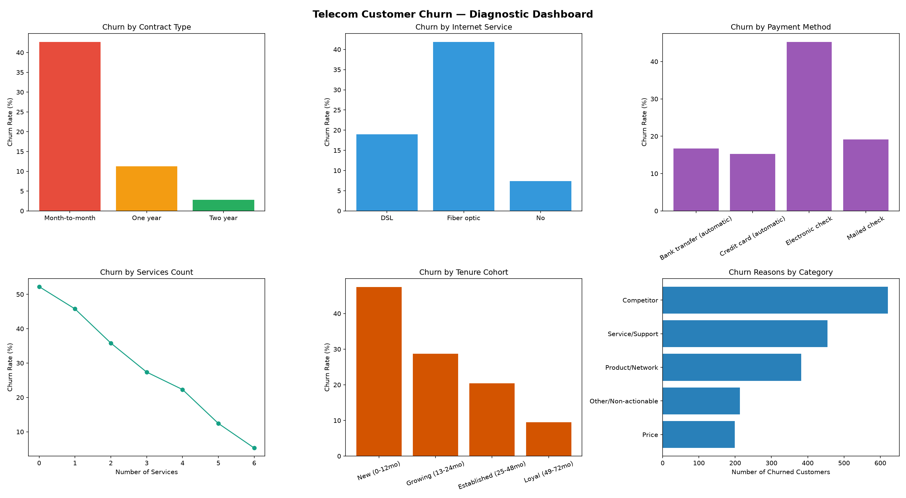

# 📉 Telecom Customer Churn Analysis
### Diagnosing why customers leave, quantifying revenue at risk, and identifying where to intervene first


---

## 📌 Overview

This project analyzes customer churn for a telecom business using IBM's Telco Customer Churn dataset (7,043 customers). It walks through the full analyst workflow: data ingestion via SQL, cleaning, feature engineering, KPI calculation, segmented exploratory analysis, correlation analysis, and business-facing recommendations — all backed by real, statistically meaningful sample sizes.

## 🎯 Business Problem

Subscription revenue depends on retention as much as acquisition. This project answers three questions a Customer Success or Growth team would actually ask:
1. **Who is churning** — which contract types, service tiers, and payment methods are most exposed?
2. **Why are they churning** — price, service quality, competitive pressure, or something else?
3. **How much revenue and lifetime value is actually at risk?**

## 🎯 Objectives
- Consolidate and clean a real-world telecom dataset via a SQL-based ingestion pipeline.
- Calculate core subscription-business KPIs: churn rate, retention, ARPU, revenue at risk, CLTV at risk.
- Segment churn across contract type, internet service, payment method, add-on services, and tenure.
- Identify and correct a confounding variable during analysis (services count vs. internet access).
- Build a correlation analysis while explicitly identifying and avoiding data leakage.
- Translate every finding into a specific, actionable business recommendation.

## 🗂️ Dataset

**Source:** [IBM Telco Customer Churn dataset](https://www.kaggle.com/datasets/yeanzc/telco-customer-churn-ibm-dataset) (Kaggle)
7,043 customers, 33 original fields covering demographics, account details, service subscriptions, billing, satisfaction/churn scores, and stated cancellation reasons.

> **Note:** the raw data file isn't included in this repository (see `.gitignore`). Download it from the Kaggle link above and place it at `data/raw/Telco_customer_churn.xlsx` to run the notebook yourself.

## 🛠️ Tools Used
- **Python 3.12**
- **Pandas / NumPy** — data cleaning, feature engineering, aggregation
- **Matplotlib / Seaborn** — visualization
- **SQLite3** — relational data storage and querying
- **Jupyter Notebook** — analysis environment

## 🔄 Project Workflow
1. **Data Ingestion** — load the source Excel file, clean column names, load into a SQLite database via a reusable SQL pipeline.
2. **Data Cleaning** — fix a hidden blank-value quirk in `total_charges`, convert Yes/No text columns into 0/1 flags (while preserving readable originals), and correctly handle "No internet/phone service" as equivalent to "No."
3. **Feature Engineering** — derive `services_count` (add-on service count per customer) and `tenure_cohort` (lifecycle stage buckets).
4. **KPI Analysis** — churn rate, retention rate, ARPU, revenue at risk (monthly + annualized), CLTV at risk.
5. **Segmented Diagnostic Analysis** — churn broken down by contract type, internet service, payment method, services count, and tenure cohort — including catching and correcting a confounding variable along the way.
6. **Cancellation Reason Analysis** — 20 raw stated reasons grouped into 5 actionable business categories.
7. **Correlation Analysis** — full feature correlation matrix, with an explicit data-leakage callout on the dataset's pre-existing `churn_score` field.
8. **Diagnostic Dashboard** — a 6-panel summary visualization combining the strongest findings into one image.

## 🔑 Key Insights

- **Contract length is the single strongest churn driver.** Month-to-month customers churn at **42.71%** vs. **2.83%** for two-year contracts — a ~15x difference, and month-to-month is also the largest segment (3,875 customers).
- **Fiber optic customers churn most, largely driven by price.** 41.89% churn vs. 18.96% for DSL — Fiber customers pay ~58% more per month on average ($91.50 vs. $58.10).
- **Payment friction is a major factor.** Electronic check users churn at **45.29%**, nearly 3x higher than automatic payment methods, and it's the largest payment segment (2,365 customers).
- **Add-on services build stickiness.** Among customers with internet, churn drops from 52.24% (0 services) to 5.28% (6 services) — this pattern was hidden until a confounding variable (no-internet customers) was identified and removed from the comparison.
- **Churn risk is front-loaded.** New customers (0–12 months) churn at 47.44%, dropping to just 9.51% for customers with 49+ months of tenure.
- **Competitive pressure is the leading stated reason for leaving** (33.23% of churned customers), ahead of Price (10.65%) and Product/Network issues (20.44%).

## 💡 Business Recommendations
1. Incentivize month-to-month customers toward longer contracts — even a shift to one-year cuts churn risk ~4x.
2. Investigate Fiber Optic pricing and service quality — highest churn, highest revenue segment.
3. Drive AutoPay adoption among Electronic Check users through small incentives.
4. Build a first-90-day onboarding program targeting the highest-risk tenure window.
5. Strengthen competitive positioning and proactive retention offers, since competitor pressure — not price — is the leading driver of churn.

## 📁 Folder Structure
telecom-customer-churn-analysis/
├── README.md
├── requirements.txt
├── .gitignore
├── data/
│   └── raw/              (not included — see Dataset section above)
├── notebooks/
│   └── telecom_churn_analysis.ipynb
└── images/
├── churn_by_contract.png
├── churn_reasons_category.png
├── correlation_heatmap.png
└── churn_dashboard.png

## ▶️ How to Run
```bash
git clone https://github.com/anirudh7537/telecom-customer-churn-analysis.git
cd telecom-customer-churn-analysis

python -m venv venv
source venv/bin/activate      # Windows: venv\Scripts\activate
pip install -r requirements.txt
```
Then download the dataset from the Kaggle link above, place it at `data/raw/Telco_customer_churn.xlsx`, and open the notebook:
```bash
jupyter notebook notebooks/telecom_churn_analysis.ipynb
```

## 📊 Results

| Metric | Value |
|---|---|
| Total Customers | 7,043 |
| Churn Rate | 26.54% |
| Retention Rate | 73.46% |
| ARPU | $64.76 |
| Average Tenure | 32.4 months |
| Monthly Revenue at Risk | $139,130.85 |
| Annualized Revenue at Risk | ~$1.67M |
| Total CLTV at Risk | $7.75M |

## 🖼️ Visualizations

**Churn by Contract Type**


**Cancellation Reasons by Category**


**Feature Correlation Heatmap**


**Full Diagnostic Dashboard**


## 🚀 Future Improvements
- **Predictive modeling (planned next phase):** train a churn prediction model (logistic regression / random forest) on the engineered features, explicitly excluding the dataset's pre-existing `churn_score` field to avoid data leakage. Currently paused pending deeper ML fundamentals.
- **Interactive dashboard:** port the KPI scorecard and segment views into Plotly Dash, Streamlit, or Power BI.
- **Survival/cohort analysis:** model time-to-churn rather than a single point-in-time flag.

## 🧾 Conclusion
This project demonstrates a complete analyst workflow — from relational SQL data through cleaning, feature engineering, diagnostic analysis, and business-facing recommendations — including catching and correcting a real confounding variable and explicitly identifying data leakage risk. The findings and methodology are designed to extend directly into predictive modeling as a next phase.

## 👤 Author
**Anirudh Gandhi**
B.Tech CSE (Data Analytics & Machine Learning) · Global Institute of Technology, Jaipur
[GitHub](https://github.com/anirudh7537) · [Portfolio](https://anirudh-gandhi-portfolio.vercel.app)
